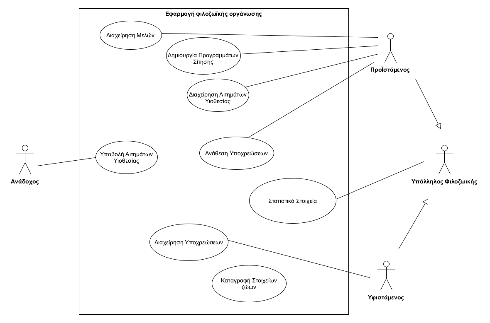
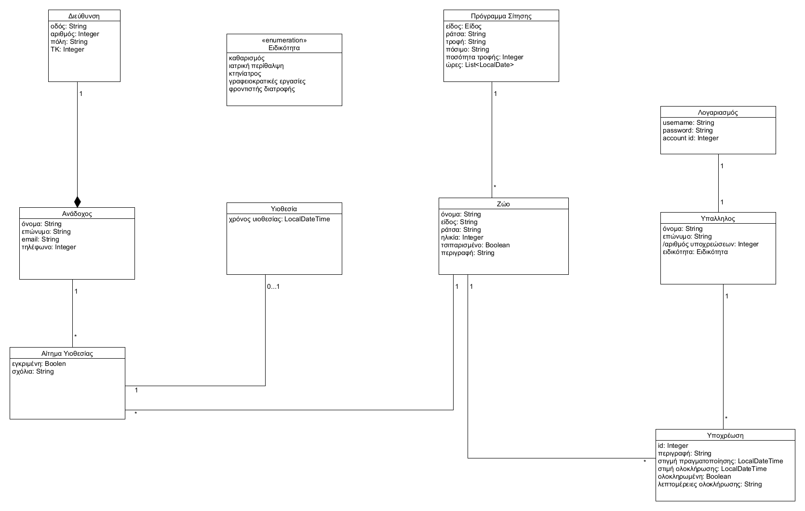
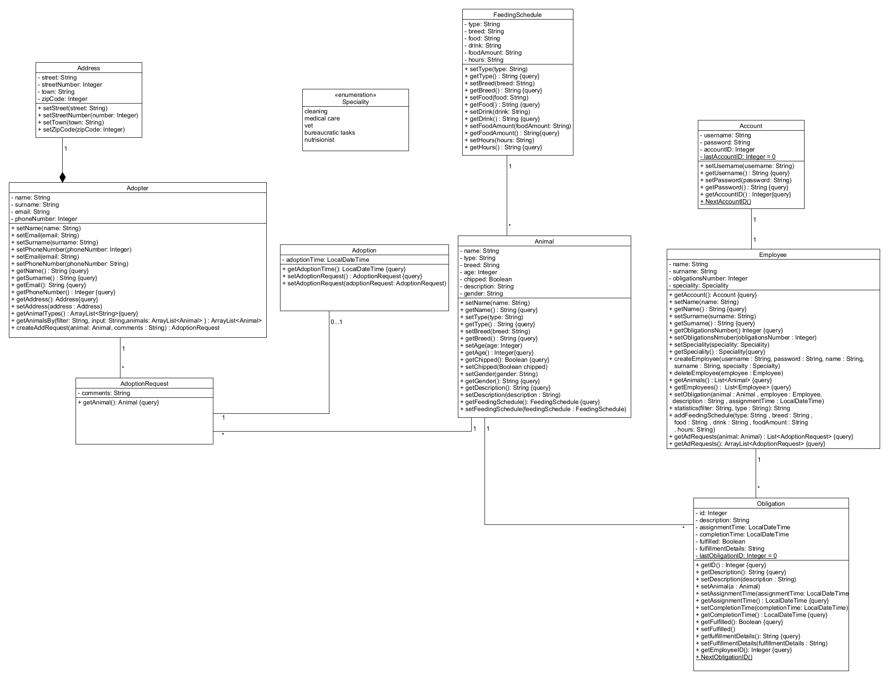

# Εισαγωγή
Αυτό το repository ασχολείται με μια εφαρμογή διαχείρησης φιλοζωικών οργανώσεων και εξυπηρετεί τις ανάγκες της εκάστοτε φιλοζωικής οργάνωσης, καθώς και των πιθανών αναδόχων.

# Απαιτήσεις λογισμικού - Εφαρμογή φιλοζωικής οργάνωσης

## Σύστημα
Το σύστημα θα:
* υποστηρίζει τα καθήκοντα του υπεύθυνου μιας φιλοζωικής οργάνωσης και των εργαζομένων της. 
* παρέχει τη δυνατότητα σε πιθανούς αναδόχους, να βλέπουν τα ζώα της οργάνωσης που είναι διαθέσιμα προς υιοθεσία με βάση διάφορα κριτήρια, πχ. ηλικία, ράτσα, είδος ζώου κτλ.
* εμφανίζει σε ξεχωριστή λίστα τις υποχρεώσεις που δεν έχουν ολοκληρωθεί,μία απο τις οποίες είναι και η σίτηση
* διατηρεί αρχείο υιοθέτησης όπου θα καταγράφεται η κατάσταση κάποιου ζώου ως υιοθετημένο και θα καταγράφονται τα στοιχεία του ανθρώπου που τα υιοθέτησε.
* παρουσιάζει στατιστικά στοιχεία σχετικά με το ποσοστό των ζώων που έχουν μείνει στην φιλοζωική και αυτών που έχουν υιοθετηθεί, το ποσοστό πληρότητας των κλουβιών, το ποσοστό των ζώων που μένουν στην φιλοζωική ανά είδος και του κάθε είδους ανά ράτσα.
* συνδέει κάθε ζώο με ένα πρόγραμμα σίτισης το οποίο θα επιλέγεται από προκαθορισμένα προγράμματα, τα οποία θα διαφοροποιούνται ανάλογα με το είδος και τη ράτσα του ζώου.

## Υπεύθυνος της Φιλοζωικής (Προϊστάμενος)
Θα έχει τη δυνατότητα:
* να καταγράφει τα μέλη της φιλοζωικής οργάνωσης
* να αναθέτει υποχρεώσεις όπως καθαρισμός, περίθαλψη συγκεκριμένων ζώων με τροφή και νερό.
* να καταγράφει και να επεξεργάζεται τα χαρακτηριστικά του χώρου της οργάνωσης όπως το πλήθος των κλουβιών.
* να δημιουργεί προγράμματα σίτησης
* να εγκρίνει τα αιτήματα υιοθεσίας
* σε περίπτωση πολλαπλών αιτημάτων για ένα ζώο να κάνει επιλογή του αναδόχου με βάση την κρίση του.

## Εργαζόμενοι της Φιλοζωικής (Υφιστάμενοι)
Θα μπορούν:
* να επισημαίνουν τη σίτιση κάθε ζώου όποτε αυτή πραγματοποιείται, και γενικά των υποχρεώσεων που τους έχουν ανατεθεί.
* να καταγράφουν τα χαρακτηριστικά των ζώων όπως το είδος, η ράτσα, το βάρος, η ηλικία, το κλουβί του, η ιατρική κατάσταση , αν έχει chip ή όχι και αν μπορεί να υιοθετηθεί ή όχι.
* να καταγράφουν τις ατομικές διατροφικές συνήθειες, όπως το είδος της τροφής και η συχνότητα ταΐσματος.

## Ανάδοχοι
Οι Ανάδοχοι θα μπορούν να υποβάλλουν αιτήματα υιοθεσίας ζώων

# Συνολική περιγραφή

## Διάγραμμα Περιπτώσεων Χρήσης

# Ειδικές Απαιτήσεις

## Περιπτώσεις Χρήσης
#

### Περιγραφές περιπτώσεων χρήσης

[ΠΧ1 Διαχείρηση Μελών](docs/markdown/uc1.md)

[ΠΧ2 Δημιουργία Προγραμμάτων Σίτησης](docs/markdown/uc2.md)

[ΠΧ3 Διαχείρηση Αιτημάτων Υιοθεσίας](docs/markdown/uc3.md)

[ΠΧ4 Υποβολή Αιτημάτων Υιοθεσίας](docs/markdown/uc4.md)

[ΠΧ5 Ανάθεση Υποχρεώσεων](docs/markdown/uc5.md)

[ΠΧ6 Στατιστικά Στοιχεία](docs/markdown/uc6.md)

[ΠΧ7 Διαχείρηση Υποχρεώσεων](docs/markdown/uc7.md)

[ΠΧ8 Καταγραφή Στοιχείων ζώων](docs/markdown/uc8.md)

# Συμπληρωματικές Προδιαγραφές

## Ποιοτικά χαρακτηριστικά

### Μη-Λειτουργικές Απαιτήσεις 
#

**Ευχρηστία:**  Το σύστημα θα πρέπει να είναι πολύ απλό στη χρήση και να γίνεται εύκολα κατανοητό , καθώς απευθύνεται στον μέσο άνθρωπο.

**Συντήρηση:**   Το σύστημα πρέπει να είναι εύκολο στη συντήρησή του.

**Διαθεσιμότητα:**   Το σύστημα πρέπει να είναι διαθέσιμο όταν χρειάζεται.

**Αξιοπιστία:**   Το σύστημα πρέπει να είναι αξιόπιστο , καθώς το αρχείο που κρατείται μπορεί να χρειαστεί ακόμα και για νομικά ζητήματα.

# Υποστηρικτικό Υλικό

## Μοντέλο πεδίου

## Διάγραμμα Κλάσεων

