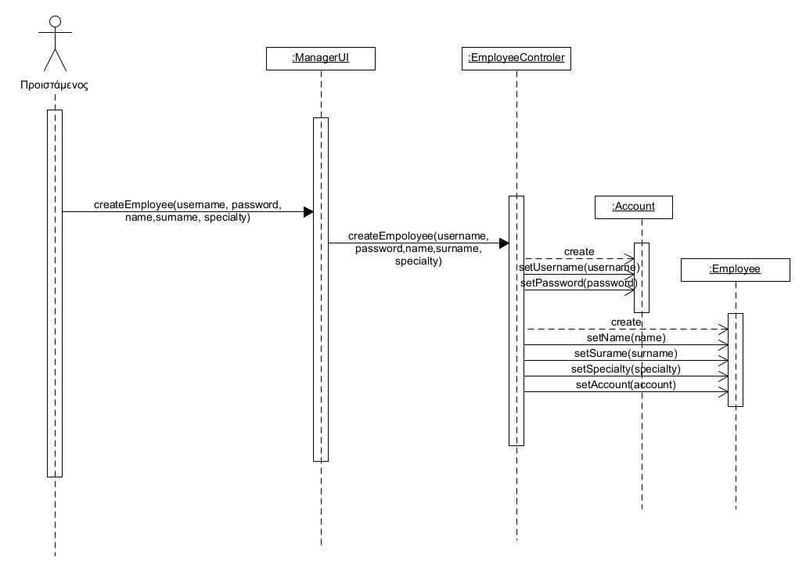
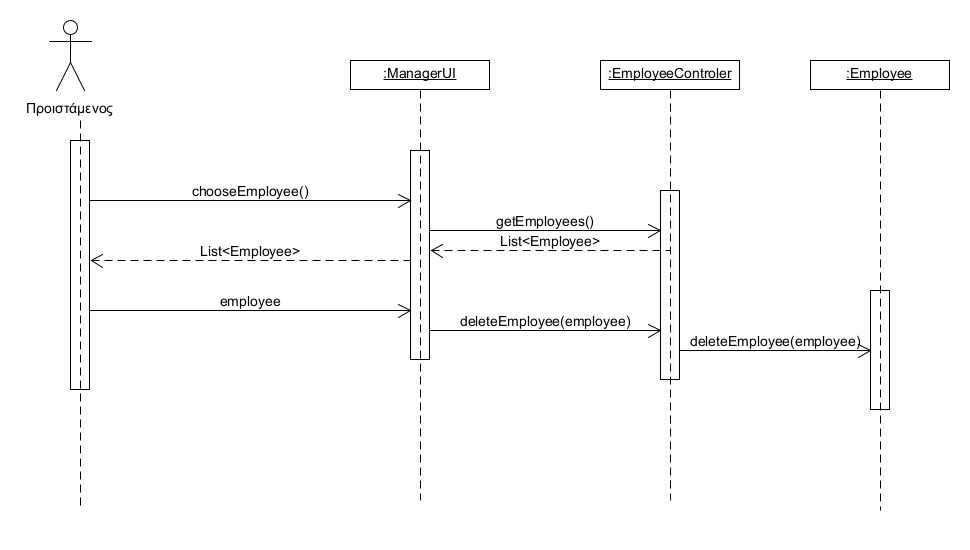

# ΠΧ1. Διαχείριση Μελών

**Πρωτεύον Actor**: Προϊστάμενος 

**Ενδιαφερόμενοι**   

&emsp;**Προϊστάμενος**: Θέλει να καταγραφούν ή να διαγραφούν οι πληροφορίες των υπαρχόντων καθώς και νέων μελών της φιλοζωικής. 

&emsp;**Υφιστάμενος**: Θέλει να εγγραφεί στο σύστημα και να λάβει τους κωδικούς πρόσβασης του στην εφαρμογή. 

**Προϋποθέσεις**:  

Ο προϊστάμενος να έχει ταυτοποιηθεί από το σύστημα. 

Το νέο μέλος να μην υπάρχει ήδη στο σύστημα. 

Το νέο μέλος να μην εισάγει τα ίδια στοιχεία πρόσβασης με κάποιο άλλο μέλος της φιλοζωικής. 

## Βασική Ροή
#

### Α) Εισαγωγή Μελών 
 

1. Ο προϊστάμενος  επιλέγει να εισάγει νέο μέλος.  

2. Το σύστημα εμφανίζει μια φόρμα στοιχείων εργαζομένου, όπως  ονοματεπώνυμο, τηλέφωνο, διεύθυνση και στοιχεία πρόσβασης στην εφαρμογή(username, password). 

3. Ο προϊστάμενος συμπληρώνει τις πληροφορίες του νέου μέλους. 

4. Ο προϊστάμενος υποβάλει την φόρμα. 

5. Το σύστημα καταχωρεί το νέο μέλος. 

**Εναλλακτικές ροές**

*4α. Ο προϊστάμενος δεν έχει εισάγει τα υποχρεωτικό  στοιχείο της φόρμας καταχώρησης νέου μέλους:username,password,ονοματεπώνυμο και τηλέφωνο.* 

1. Το σύστημα εμφανίζει κατάλληλο μήνυμα σφάλματος. 

2. Η ΠΧ επιστρέφει στο βήμα 2 της βασικής ροής. 

*4β. Κάποιο από τα βασικά μοναδικά στοιχεία στην φόρμα καταχώρησης(username,τηλέφωνο) ταιριάζει με ήδη υπάρχων μέλος της φιλοζωικής* 

1. Το σύστημα εμφανίζει κατάλληλο μήνυμα σφάλματος. 

2. Η ΠΧ επιστρέφει στο βήμα 2 της βασικής ροής. 

### B) Διαγραφή Μελών 

1. Ο προϊστάμενος  επιλέγει να διαγράψει ένα μέλος. 

2. Το σύστημα του παρουσιάζει τα καταχωρημένα μέλη της φιλοζωικής. 

3. Ο υπάλληλος επιλέγει ποιο μέλος θέλει να διαγράψει από το σύστημα. 

4. Το σύστημα διαγράφει το μέλος. 

**Εναλλακτικές ροές**

*2α. Δεν υπαρχουν καταγεγραμένα μέλη στο σύστημα.*

1. Το σύστημα ενημερώνει τον χρήστη ότι δεν υπάρχουν μέλη για να διαγράψει.

## Διάγραμμα Ακολουθίας Εισαγωγή Μελών

## Διάγραμμα Ακολουθίας Διαγραφή Μελών
