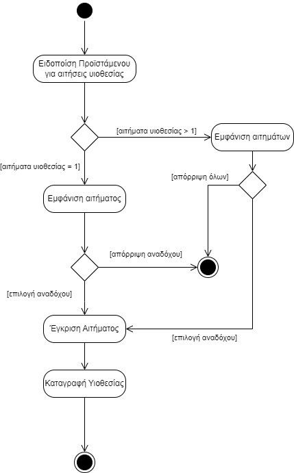
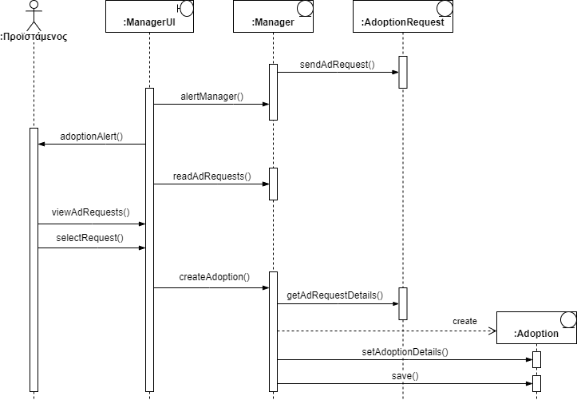

# ΠΧ3. Διαχείριση Αιτημάτων Υιοθεσίας 

**Πρωτεύων Actor**: Προϊστάμενος

**Ενδιαφερόμενοι:** 

&emsp;**Προϊστάμενος**: Θέλει να αποφασίσει σε ποιόν ανάδοχο θα παραπεμφθεί ένα ζώο της οργάνωσης , εφόσον υπάρχει ενδιαφέρον για την υιοθέτηση αυτού από παραπάνω του ενός ανάδοχους.

&emsp;**Ανάδοχος**: Θέλει να μάθει εάν θα υιοθετήσει το ζώο για το οποίο υπέβαλε αίτημα.

**Προϋποθέσεις**: Έχει πραγματοποιηθεί με επιτυχία από τον Ανάδοχο η [ΠΧ4. Υποβολή Αιτημάτων Υιοθεσίας](uc4.md) για τα ζώα που τον ενδιαφέρουν.

## Βασική Ροή
#
### Αίτημα Υιοθεσίας

1.	Το Σύστημα ειδοποιεί τον Προϊστάμενο ότι υπάρχει ενδιαφέρον για ένα ζώο.
2.	Ο Προϊστάμενος βλέπει το αίτημα υιοθεσίας.
3.	Ο Προϊστάμενος εγκρίνει το αίτημα.
5.	Το σύστημα καταγράφει την υιοθεσία και τα στοιχεία του αναδόχου και του ζώου στο αρχείο.
6.	Η επικοινωνία Προϊσταμένου-Αναδόχου συνεχίζεται εκτός του συστήματος.

**Εναλλακτικές Ροές**

*2α. Υπάρχει ενδιαφέρον από περισσότερους του ενός αναδόχους για το ίδιο ζώο.*  

1. Ο Προιστάμενος επιλέγει έναν από τους υποψηφίους ώς τον ανάδοχο του ζώου.
2. Επιστρέφει στο βήμα 3 της βασικής ροής.

*3α. Ο Προϊστάμενος αποφασίζει να μην εγκρίνει το μοναδικό αίτημα.*  

1. Ο Προϊστάμενος ενημερώνει εκτός του συστήματος τον υποψήφιο ανάδοχο για την μη συνέχιση της διαδικασίας.

*3β. Ο Προϊστάμενος αποφασίζει να μην εγκρίνει κανένα από τα αιτήματα.*  

1. Ο Προϊστάμενος ενημερώνει εκτός του συστήματος τους υποψηφίους αναδόχους για τη μη συνέχιση της διαδικασίας.

## Διάγραμμα Δραστηριότητας

## Διάγραμμα Ακολουθίας
