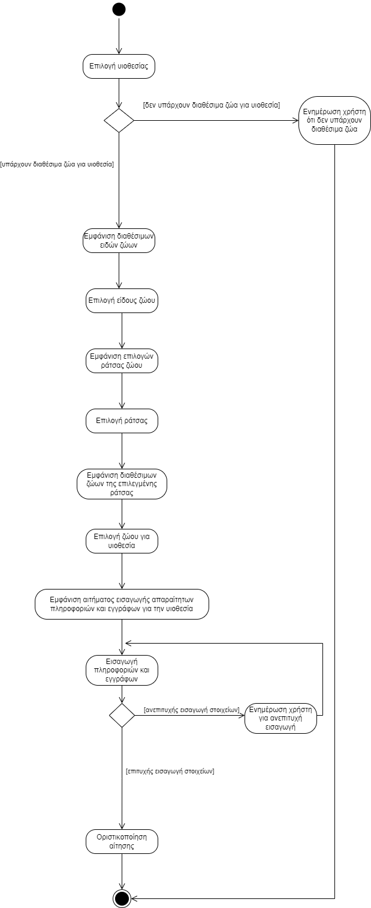
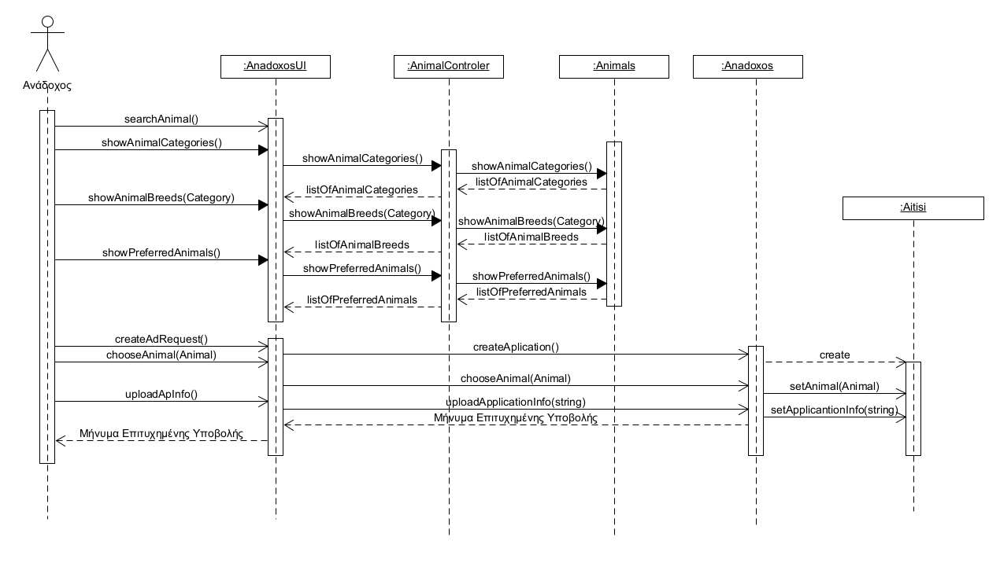

# ΠΧ4. Υποβολή Αιτήματος Υιοθεσίας

**Πρωτεύων Actor**: Ανάδοχος  

**Ενδιαφερόμενοι** 

&emsp;**Ανάδοχος**: Θέλει να υιοθετήσει ένα από τα διαθέσιμα ζώα της οργάνωσης.

**Προϋποθέσεις**: Έχει πραγματοποιηθεί με επιτυχία από τον Υφιστάμενο η [ΠΧ8. Καταγραφή Στοιχείων Ζώων](uc8.md) ώστε να εμφανίζονται στο σύστημα τα διαθέσιμα για υιοθεσία. 

## Βασική Ροή
#
### Υποβολή Αιτήματος Υιοθεσίας

1.	Ο Ανάδοχος ανοίγει την εφαρμογή.
2.	Βλέπει τα διαθέσιμα προς υιοθεσία ζώα της οργάνωσης.
3.	Το σύστημα του εμφανίζει τις αντίστοιχες επιλογές σε ράτσες , είδος κτλ.
4.	Ο Ανάδοχος επιλέγει το είδος ζώου που τον ενδιαφέρει.
5.	Το σύστημα του εμφανίζει τα αντίστοιχα είδη ζώων. 
6.	Ο Ανάδοχος διαλέγει το είδος που τον ενδιαφέρει.
7.	Το σύστημα του εμφανίζει τις ράτσες για αυτό το είδος
8.	Ο ανάδοχος επιλέγει το ζώο που θέλει να υιοθετήσει.
9.	Το σύστημα του ζητάει τις απαραίτητες πληροφορίες και τα απαραίτητα έγγραφα που χρειάζονται.
10.	Ο Ανάδοχος τα εισάγει.
11.	Ο Ανάδοχος οριστικοποιεί την αίτησή του.

**Εναλλακτικές Ροές**

*2α. Το σύστημα δεν έχει διαθέσιμα ζώα προς υιοθεσία.*  
1. Το σύστημα ενημερώνει τον ανάδοχο ότι δεν υπάρχουν αυτή τη στιγμή διαθέσιμα προς υιοθεσία ζώα.
   
*10α. Ο Ανάδοχος δεν εισάγει τα απαραίτητα έγγραφα και πληροφορίες.*  
1.	Το σύστημα τον ενημερώνει ότι δεν έχει εισάγει τα απαραίτητα στοιχεία.
2.	Ο ανάδοχος ξαναπηγαίνει στο βήμα 9 της βασικής ροής.

## Διάγραμμα Δραστηριότητας

## Διάγραμμα Ακολουθίας

