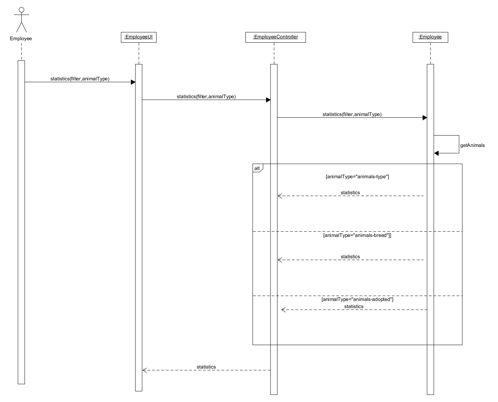

# ΠΧ6. Στατιστικά Στοιχεία

**Πρωτεύων Actor**: Υπάλληλος Φιλοζωικής

**Ενδιαφερόμενοι:** 

&emsp;**Προϊστάμενος**: Θέλει να γνωρίζει τα ποσοστά υιοθεσίας των ζώων της οργάνωσης ώστε να επιληφθεί πιθανών προβλημάτων που υπάρχουν στη φιλοζωική. Θέλει να γνωρίζει το ποσοστό πληρότητας ώστε να μπορεί να αποφασίσει εάν θα δεχτεί κάποιο νέο ζώο για περίθαλψη. Θέλει να γνωρίζει τα διάφορα στατιστικά που αφορούν τα είδη που φιλοξενούνται ώστε να μπορεί να υπολογίζει τις αντίστοιχες ανάγκες που έχουν.

&emsp;**Υφιστάμενος**: Θέλει να βλέπει τα στατιστικά στοιχεία της οργάνωσης ώστε ανάλογα με τις δεξιότητες του να υπολογίζει ανάγκες που παρατηρεί ότι υπάρχουν στη φιλοζωική.

**Προϋποθέσεις**: Ο προϊστάμενος έχει εκτελέσει με επιτυχία τη [ΠΧ1. Διαχείρηση Μελών](uc1.md) 
ώστε τα εκάστοτε μέλη της οργάνωσης να έχουν πρόσβαση στην εφαρμογή. Έχει πραγματοποιηθεί με επιτυχία η περίπτωση χρήσης [ΠΧ8. Καταγραφή Στοιχείων Ζώων](uc8.md) 
κάθε φορά που κάποιο ζώο έχει προσέλθει στην οργάνωση για περίθαλψη , από κάποιον υφιστάμενο.

## Βασική Ροή
#
1. Ο Υπάλληλος της Φιλοζωικής επιλέγει να δει τα στατιστικά στοιχεία.
2. Το σύστημα του εμφανίζει τις διαθέσιμες κατηγορίες των στατιστικών στοιχείων.
3. Ο υπάλληλος επιλέγει τη κατηγορία των στατιστικών που τον ενδιαφέρουν.
4. Το σύστημα του εμφανίζει τα στοιχεία που επίλεξε.

**Εναλλακτικές Ροές**

*5β. Το σύστημα δεν έχει καθόλου εγγραφές για ζώα.*  
1. Το σύστημα ενημερώνει τον χρήστη ότι δεν υπάρχουν ζώα στο σύστημα.

## Διαγραμμα Ακολουθίας

