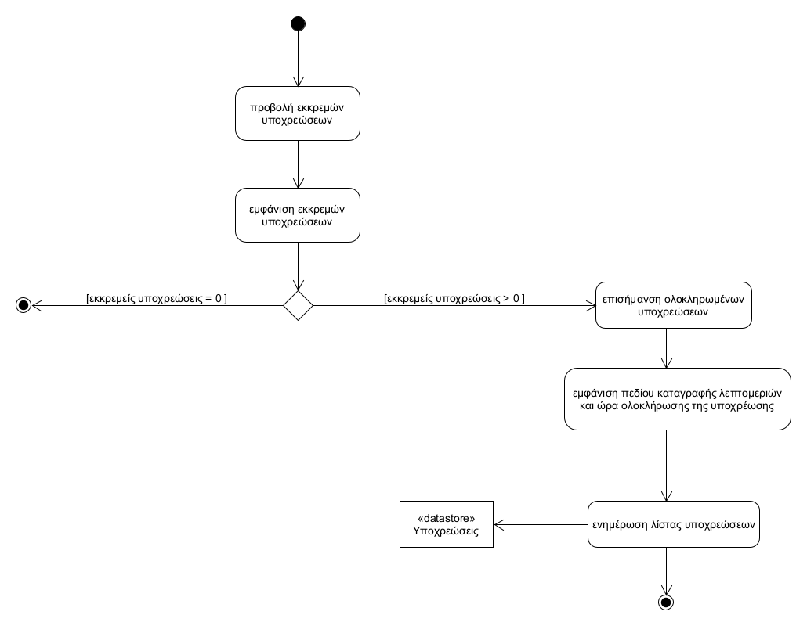
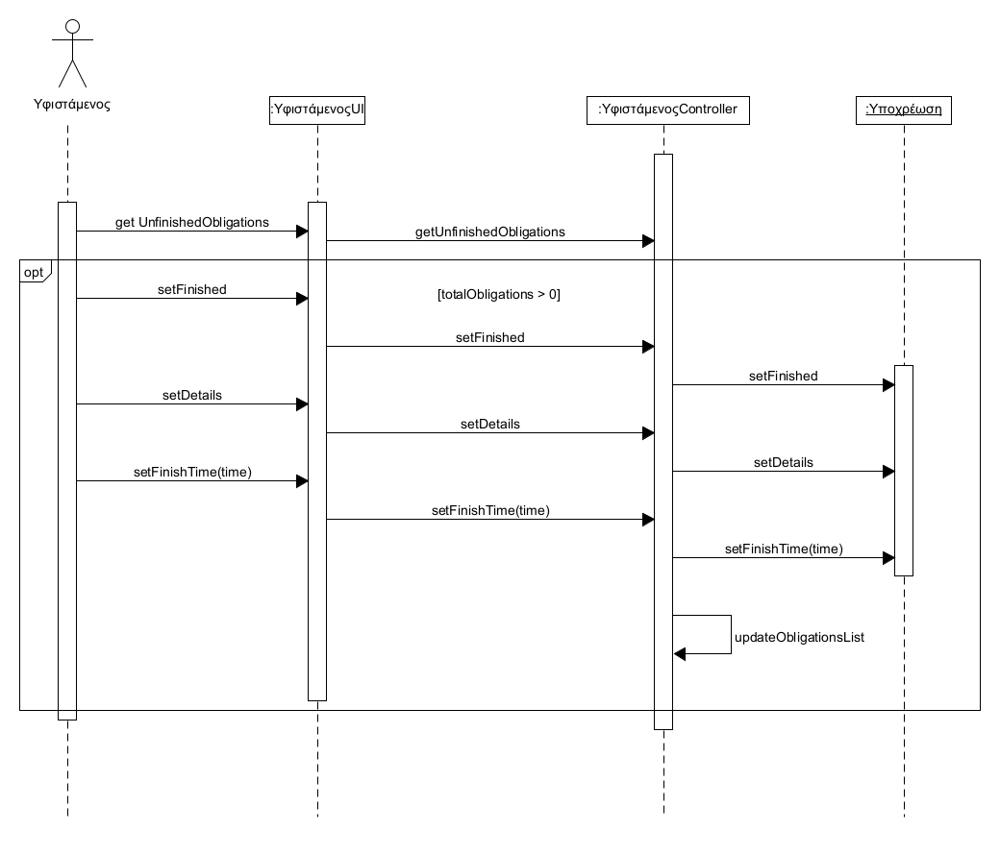

# ΠΧ7. Διαχείρηση Υποχρεώσεων
**Πρωτεύων Actor**: Υφιστάμενος

**Ενδιαφερόμενοι**

&emsp;**Υφιστάμενος**: Θέλει να επισημαίνει τις υποχρώσεις του όποτε αυτές πραγματοποιούνται.

**Προϋποθέσεις**: ο Προϊστάμενος να έχει εκτελέσει τη [ΠΧ.5 Ανάθεση Υποχρεώσεων](uc5.md), που να αφορά τον συγκεκριμένο υφιστάμενο

## Βασική Ροή
#
1. Ο υφιστάμενος επιλέγει να δει τις εκκρεμείς του υποχρεώσεις
2. Το Σύστημα εμφανίζει ολες τις εκκρεμείς υποχρεώσεις του υφιστάμενου
3. Ο υφιστάμενος επιλέγει και επισημαίνει την υποχρέωση που ολοκλήρωσε επιτυχώς
4. Το Σύστημα του εμφανίζει ένα πεδίο οπου καταγράφει τυχον λεπτομέρειες και ώρα ολοκλήρωσης της υποχρέωσης
5. Το Σύστημα ενημερώνει την λίστα των υποχρεώσεων
### Εναλλακτικές Ροές

*3α. Δεν υπάρχουν εκκρεμείς του υποχρεώσεις *
1. Η εκτέλεση της περίπτωσης χρήσης τερματίζεται

## Διαγραμμα Δραστηριοτητας

## Διαγραμμα Δραστηριοτητας

